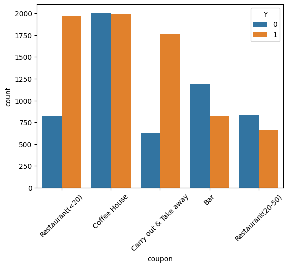
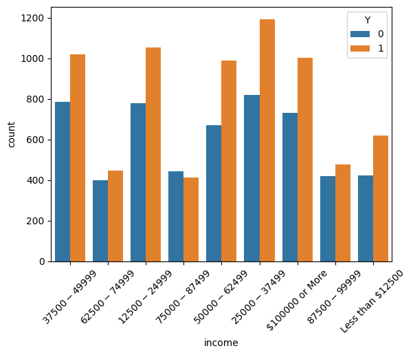
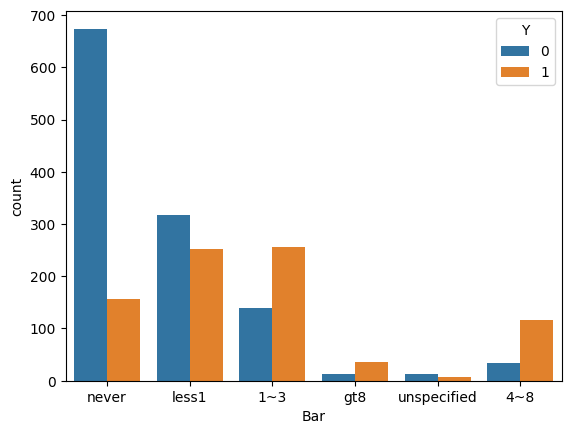
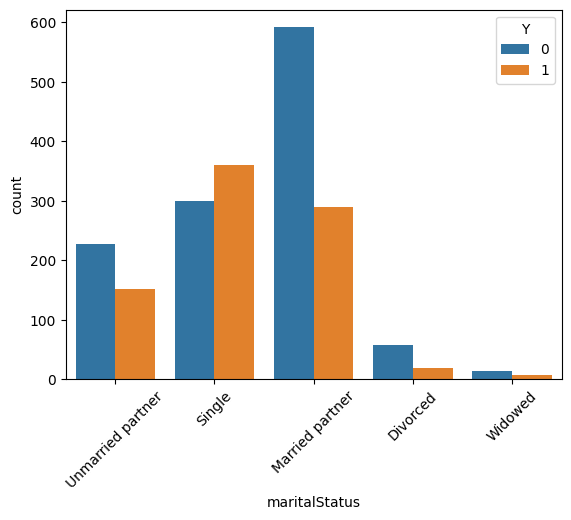

## Practical Application Assignment 5.1: Will the Customer Accept the Coupon?

This project was created as part of an online assignment for UC Berkeley's [Professional Certificate in ML &amp; AI](https://em-executive.berkeley.edu/professional-certificate-machine-learning-artificial-intelligence?advocate_program=01t2s000000ZqNbAAK&advocate_source=dashboard&coupon=IXFD6%3A11-8KE65G8&utm_campaign=incentivized_referrals&utm_content=SO+-+Berkeley+Professional+Certificate+in+ML+%26+AI&utm_medium=personal_url&utm_placement=dashboard&utm_source=referral&utm_term=U4i1l80W3GTaStzCNlN16AsmRVmMs3322wkrdiFJJXDjWY2Kl%2FSmYByqk28Z1wpPBt57rCVH9fEKu%2Bj%2B%2B2MnNXlRmW48YqIE%2Ff68xD%2BvB2eWYj%2BrPjaTIMN4--cMEm5pJ85sMlQO6a--ybrOaW%2FFOItWpgIey12Duw%3D%3D#referrals-email-capture-modal).

### Context and objectives

A business is delivering coupons to drivers for food-related establishments in their proximity. Various information about the customer (such as income, marital status and occupation) and the settings (such as weather and temperature) are tracked. We also record whether the customer accepted the coupon.

Our goal for this study is to determine the factors that affect the coupon acceptance rate. We use a number of different techniques, including exploratory data analysis and statistical tests, in our analysis.

### Data

All attributes in the data set are categorical variables. We have the following columns available:

#### Customer attributes:

* `gender` - the driver's gender
* `age` - the age range the driver is in
* `maritalStatus` - the driver's relationship status
* `has_children` - a Boolean value indicating whether the driver has children
* `education` - the highest level of education the driver has completed
* `occupation` - the industry the driver is in
* `income` - the salary range the driver is in
* `Bar` - how often the driver goes to bars
* `CarryAway` - how often the driver orders take-out
* `CoffeeHouse` - how often the driver goes to a café
* `RestaurantLessThan20` - how often the driver goes to "cheap" restaurants
* `Restaurant20To50` - how often the driver goes to "expensive" restaurants

#### Contextual attributes

* `destination` - the driver's destination
* `toCoupon_GEQ5min` - a Boolean value indicating whether the driver is at least five minutes from their destination
* `toCoupon_GEQ15min` - a Boolean value indicating whether the driver is at least 15 minutes from their destination
* `toCoupon_GEQ25min` - a Boolean value indicating whether the driver is at least 25 minutes from their destination
* `direction_same` - a Boolean value indicating whether the business the coupon is for is in the same direction as the driver's destination
* `direction_opp` - a Boolean value indicating whether the business the coupon is for is in the opposite direction as the driver's destination
* `weather` - the weather at the time the driver received the coupon
* `temperature` - the temperature at the time the driver received the coupon
* `time` - the time of day the driver received the coupon
* `passanger`[sic] - what passengers, if any, the driver had when they received the coupon

#### Coupon attributes

* `coupon` - the type of establishment the coupon is for
* `expiration` - whether the coupon expired in one day or two hours
* `Y` - a Boolean value indicating whether the coupon was accepted. **Target variable**

### Findings

Some of our findings include:

* People who go to a bar more than once a month and are over the age of 25 have a 69.5% acceptance rate. This does not differ significantly from the 67% acceptance rate for people who go to a bar more than once a month and are *under* 25 years old
* High-income individuals are not less likely to accept coupons. We conclude people generally prefer to save money regardless of income
* People who frequent bars are generally more likely to accept a bar coupon
* Other factors, such as age and income, do not make a significant difference
* People who are married are less likely to accept bar coupons
* Coupons with an expiration time of one day has a higher acceptance rate than those that expire after just one hour

#### Recommendations

* It would be useful to have an additional column to indicate the type of coupon because the benefits conferred are often a deciding factor. For example, a coupon that offers a complimentary meal would be more practical than one that only gives a 5% discount
* Because heading towards a destination and going in the opposite direction are mutually exclusive, `direction_same` and `direction_opp` can be reduced to one variable. Dimensionality reduction can lower the complexity of machine learning models
* Similarly, the three attributes indicating the distance to the destination can also be changed to a single variable; this also has the side benefit of reducing multicollinearity

#### Sample visualizations

* Acceptance rate of coupons, separated by establishment type

* Acceptance rate of coupons, separated by income

* Acceptance rate of bar coupons, separated by frequency of visits

* Acceptance rate of bar coupons, separated by marital status

### Usage

Please see the [Google Colab tutorial](https://colab.research.google.com/drive/16pBJQePbqkz3QFV54L4NIkOn1kwpuRrj) for information on using Jupyter Notebooks.